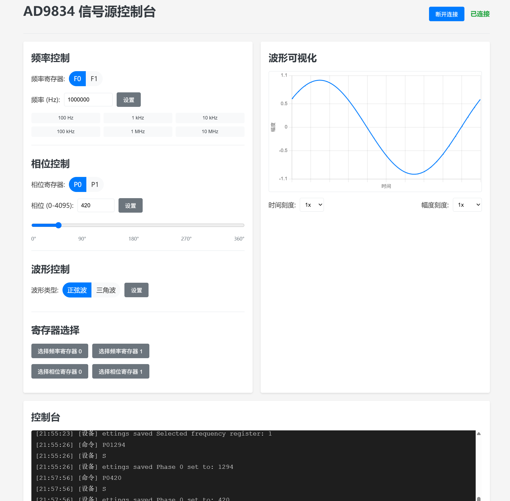

# AD9834 Signal Generator

Author: TerayTech Bilibili: https://space.bilibili.com/24434095

[中文版](README.md) | [日本語版](README_JP.md)


.JPG)

A programmable signal generator based on ESP32C3 and AD9834, supporting serial control, power-off saving, and OLED display.

## Hardware Requirements

- ESP32C3 development board
- AD9834 DDS signal generator module (75MHz active crystal)
- 0.91-inch OLED display (128x32 resolution, I2C interface)
- Connection wires

## Pin Connections

### AD9834 Connections

| AD9834 Pin | ESP32C3 Pin | Function Description |
|------------|-------------|----------------------|
| SYNC       | GPIO 0      | SPI chip select signal |
| RESET      | GPIO 1      | Reset signal |
| SCLK       | GPIO 2      | SPI clock signal |
| DATA       | GPIO 3      | SPI data signal (MOSI) |
| FSE        | GPIO 4      | Frequency register selection |
| PSE        | GPIO 21     | Phase register selection |

### OLED Display Connections

| OLED Pin | ESP32C3 Pin | Function Description |
|----------|-------------|----------------------|
| SDA      | GPIO 6      | I2C data line |
| SCL      | GPIO 7      | I2C clock line |
| VCC      | 3.3V        | Power positive |
| GND      | GND         | Power negative |

## Features

- Supports sine wave and triangle wave output
- Dual frequency registers (F0/F1) and dual phase registers (P0/P1)
- Control all parameters via serial commands
- Real-time display of current frequency, phase, and waveform type on OLED
- Uses ESP32C3's USB-CDC functionality, no external USB-to-serial chip required

## Serial Commands

| Command  | Description                                  | Example   |
|----------|----------------------------------------------|-----------|
| F0xxxxx  | Set frequency register 0 value (unit: Hz)    | F01000    |
| F1xxxxx  | Set frequency register 1 value (unit: Hz)    | F110000   |
| P0xxxx   | Set phase register 0 value (range: 0-4095)   | P00       |
| P1xxxx   | Set phase register 1 value (range: 0-4095)   | P11024    |
| SF0      | Select frequency register 0                  | SF0       |
| SF1      | Select frequency register 1                  | SF1       |
| SP0      | Select phase register 0                      | SP0       |
| SP1      | Select phase register 1                      | SP1       |
| WS       | Set waveform to sine wave                    | WS        |
| WT       | Set waveform to triangle wave                | WT        |
| ?/H      | Display help information                     | ?         |

## Software Dependencies

- Arduino framework
- Adafruit SSD1306 library (for OLED display)
- Adafruit GFX library (for OLED display)
- AD983X Arduino library (for controlling AD9834)

## Compilation and Upload

This project is managed using PlatformIO with the following configuration:

```ini
[env:airm2m_core_esp32c3]
platform = espressif32
board = airm2m_core_esp32c3
framework = arduino
monitor_speed = 115200
build_flags = 
    -DARDUINO_USB_MODE=1
    -DARDUINO_USB_CDC_ON_BOOT=1
lib_deps =
    adafruit/Adafruit SSD1306@^2.5.7
    adafruit/Adafruit GFX Library@^1.11.5
    adafruit/Adafruit BusIO@^1.14.1
```

## Usage Instructions

1. Connect the hardware according to the pin connection diagram above
2. Compile and upload the program to ESP32C3
3. Open the serial monitor (baud rate 115200)
4. Control the signal generator using serial commands
5. View current settings on the OLED screen

## Notes

- AD9834's clock reference is 75MHz, which determines the precision and range of output frequency
- Maximum output frequency is approximately 37.5MHz (half of the clock frequency)
- Phase value range is 0-4095, corresponding to 0-360 degrees
- When using USB-CDC functionality, some operating systems may require driver installation

## Extended Features

- More waveform types (such as square wave) can be added by modifying the code
- Frequency scanning functionality can be added
- Button control interface can be added to reduce dependency on serial port

## License

This project is open-sourced under the MIT license.

## Contributions

Bug reports and feature requests are welcome. If you want to contribute code, please submit a pull request.
