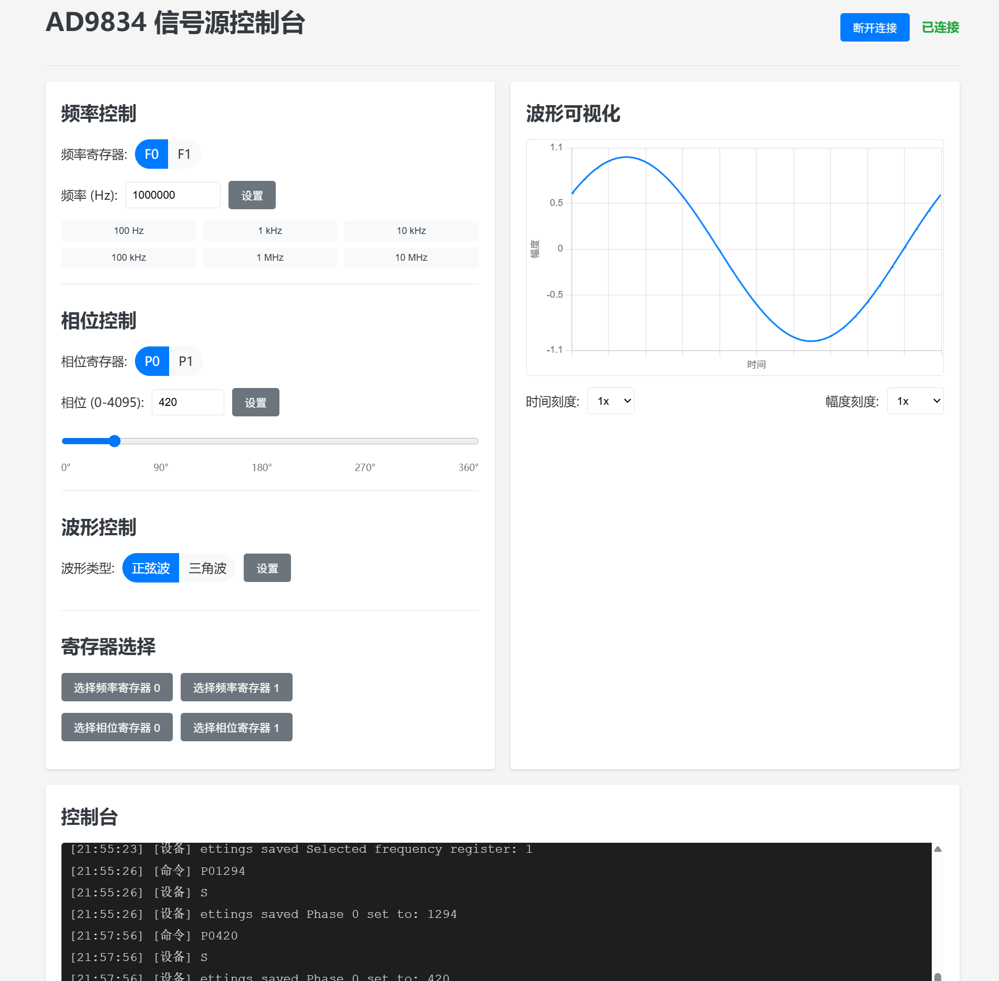

# AD9834 信号発生器

作者: TerayTech Bilibili: https://space.bilibili.com/24434095

[中文版](README.md) | [English Version](README_EN.md)


.JPG)

ESP32C3とAD9834に基づくプログラム可能な信号発生器で、シリアル制御、電源オフ保存、OLEDディスプレイをサポートしています。

## ハードウェア要件

- ESP32C3開発ボード
- AD9834 DDS信号発生器モジュール（75MHz有源水晶）
- 0.91インチOLEDディスプレイ（128x32解像度、I2Cインターフェース）
- 接続ワイヤ

## ピン接続

### AD9834接続

| AD9834ピン | ESP32C3ピン | 機能説明 |
|------------|------------|---------|
| SYNC       | GPIO 0     | SPIチップ選択信号 |
| RESET      | GPIO 1     | リセット信号 |
| SCLK       | GPIO 2     | SPIクロック信号 |
| DATA       | GPIO 3     | SPIデータ信号(MOSI) |
| FSE        | GPIO 4     | 周波数レジスタ選択 |
| PSE        | GPIO 21    | 位相レジスタ選択 |

### OLEDディスプレイ接続

| OLEDピン | ESP32C3ピン | 機能説明 |
|----------|------------|---------|
| SDA      | GPIO 6     | I2Cデータライン |
| SCL      | GPIO 7     | I2Cクロックライン |
| VCC      | 3.3V       | 電源正極 |
| GND      | GND        | 電源負極 |

## 機能特徴

- 正弦波と三角波の出力をサポート
- デュアル周波数レジスタ（F0/F1）とデュアル位相レジスタ（P0/P1）
- シリアルコマンドによるすべてのパラメータ制御
- OLEDでの現在の周波数、位相、波形タイプのリアルタイム表示
- ESP32C3のUSB-CDC機能を使用し、外部USB-シリアルチップ不要

## シリアルコマンド

| コマンド  | 説明                                | 例        |
|----------|-----------------------------------|-----------|
| F0xxxxx  | 周波数レジスタ0の値を設定（単位：Hz）    | F01000    |
| F1xxxxx  | 周波数レジスタ1の値を設定（単位：Hz）    | F110000   |
| P0xxxx   | 位相レジスタ0の値を設定（範囲：0-4095） | P00       |
| P1xxxx   | 位相レジスタ1の値を設定（範囲：0-4095） | P11024    |
| SF0      | 周波数レジスタ0を選択                 | SF0       |
| SF1      | 周波数レジスタ1を選択                 | SF1       |
| SP0      | 位相レジスタ0を選択                  | SP0       |
| SP1      | 位相レジスタ1を選択                  | SP1       |
| WS       | 波形を正弦波に設定                   | WS        |
| WT       | 波形を三角波に設定                   | WT        |
| ?/H      | ヘルプ情報を表示                    | ?         |

## ソフトウェア依存関係

- Arduinoフレームワーク
- Adafruit SSD1306ライブラリ（OLEDディスプレイ用）
- Adafruit GFXライブラリ（OLEDディスプレイ用）
- AD983X Arduinoライブラリ（AD9834制御用）

## コンパイルとアップロード

このプロジェクトはPlatformIOで管理され、設定は以下の通りです：

```ini
[env:airm2m_core_esp32c3]
platform = espressif32
board = airm2m_core_esp32c3
framework = arduino
monitor_speed = 115200
build_flags = 
    -DARDUINO_USB_MODE=1
    -DARDUINO_USB_CDC_ON_BOOT=1
lib_deps =
    adafruit/Adafruit SSD1306@^2.5.7
    adafruit/Adafruit GFX Library@^1.11.5
    adafruit/Adafruit BusIO@^1.14.1
```

## 使用方法

1. 上記のピン接続図に従ってハードウェアを接続
2. プログラムをコンパイルしてESP32C3にアップロード
3. シリアルモニタを開く（ボーレート115200）
4. シリアルコマンドで信号発生器を制御
5. OLEDスクリーンで現在の設定を確認

## 注意事項

- AD9834のクロック基準は75MHzで、これが出力周波数の精度と範囲を決定
- 最大出力周波数は約37.5MHz（クロック周波数の半分）
- 位相値の範囲は0-4095で、0-360度に対応
- USB-CDC機能を使用する場合、一部のオペレーティングシステムではドライバのインストールが必要

## 拡張機能

- コードを修正することで、より多くの波形タイプ（方形波など）を追加可能
- 周波数スキャン機能を追加可能
- ボタン制御インターフェースを追加し、シリアルポートへの依存を減らすことが可能

## ライセンス

このプロジェクトはMITライセンスの下でオープンソース化されています。

## 貢献

バグレポートと機能リクエストを歓迎します。コードに貢献したい場合は、プルリクエストを提出してください。
